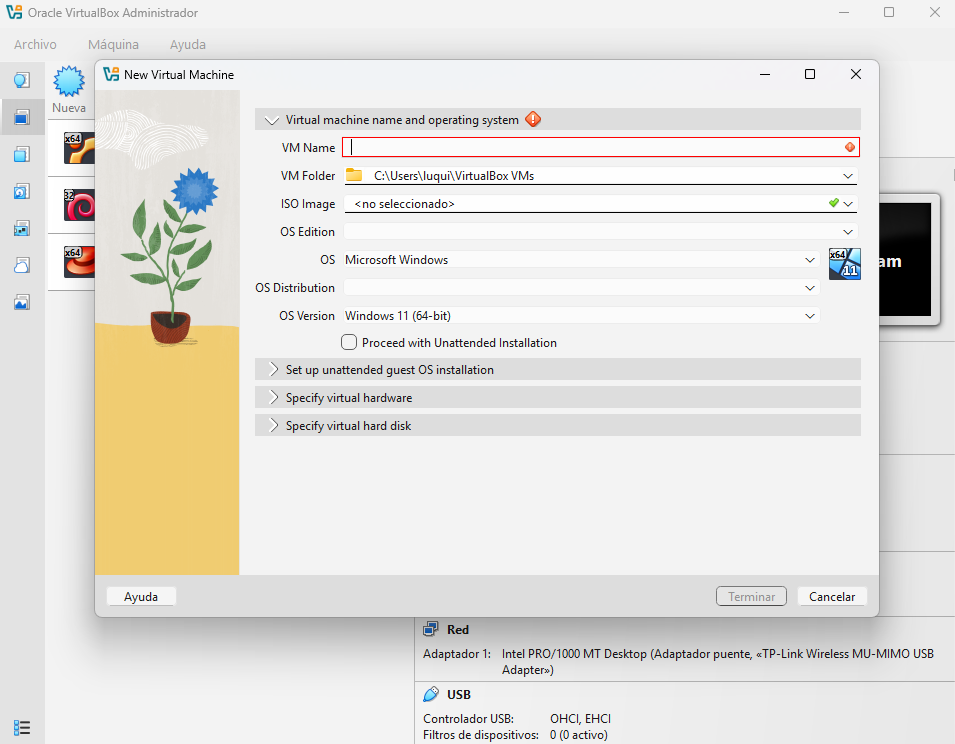
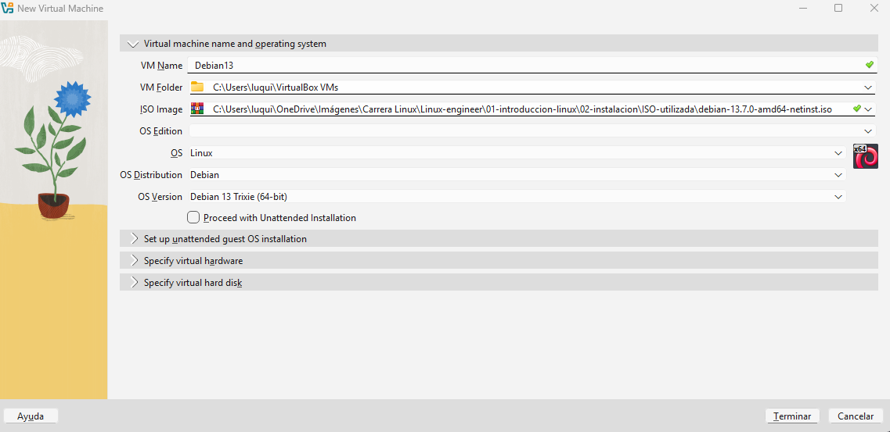
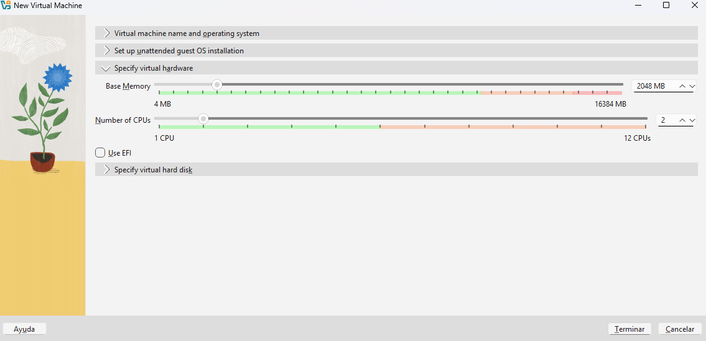
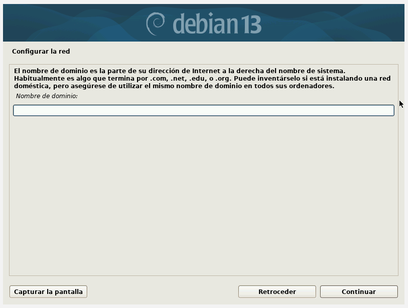
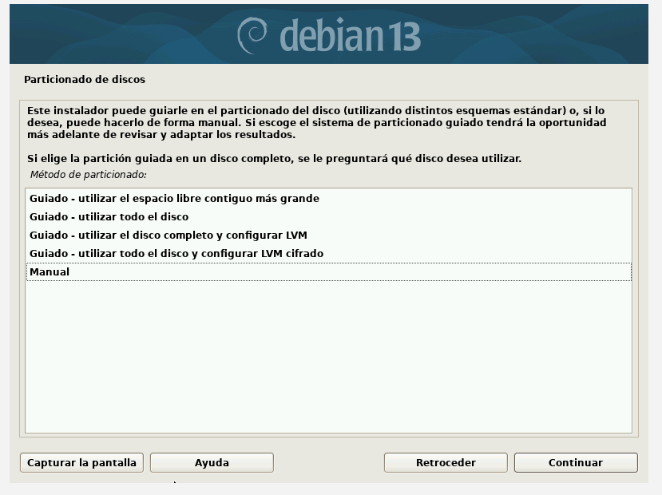
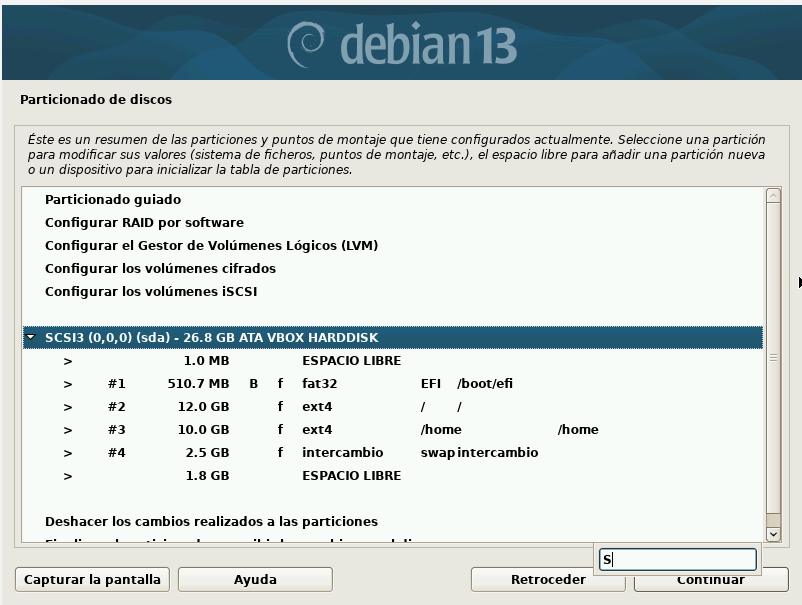
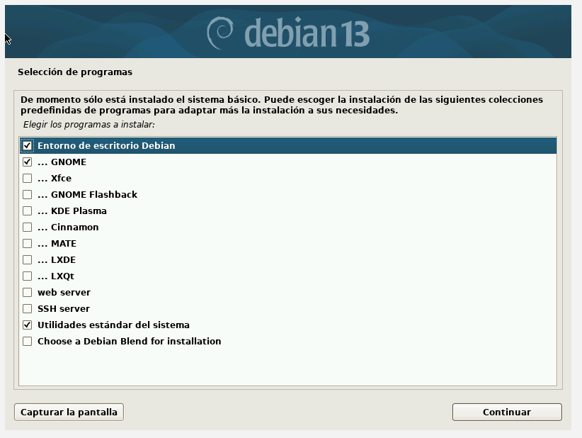
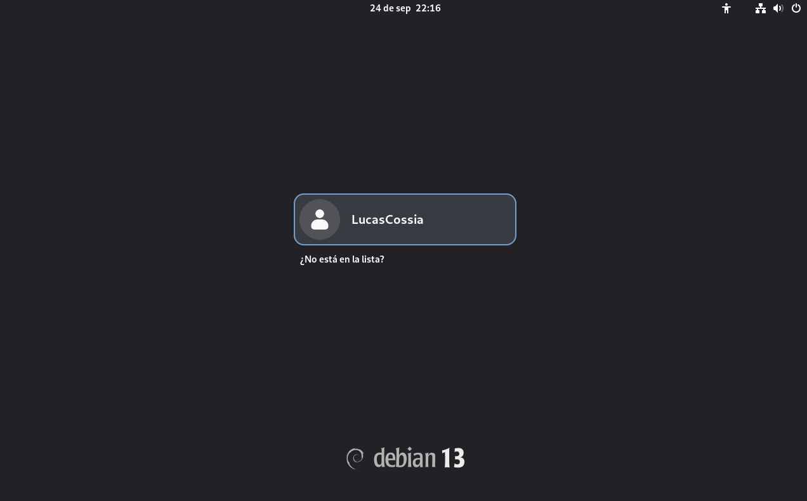

# Instalación de Linux

## Objetivo

Instalar y realizar la configuración inicial de una distribución Linux
en un entorno virtualizado.

## Entorno

| Recurso       | Configuración           |
| ------------- | ----------------------- |
| Virtualizador | VirtualBox              |
| Distribución  | Debian                  |
| CPU           | 2 vCPU                  |
| RAM           | 2 GB                    |
| Disco         | 20 GB                   |
| Red           | NAT                     |
| Arquitectura  | amdx6                   |

## Preparacion de la ISO

Para realizar la práctica se utilizó Debian 13.7.0 con arquitectura amdx64. La instalación se realizó sobre una máquina virtual creada mediante VirtualBox. Seleccione esta ISO pues es una de las distribuciones mas importantes de Linux ademas su instalacion es bastante sencilla pero podemos tocar conceptos importantes como las particiones de dico o usuario root

## Procedimiento

### **1. Creación de la máquina virtual**

Una vez instalado y configurado **VirtualBox**, y descargada la imagen ISO de **Debian**, podemos comenzar con la creación de la máquina virtual.

El objetivo de esta práctica es crear un entorno virtual donde podamos instalar Debian y realizar posteriormente distintas tareas de administración de sistemas sin modificar el sistema operativo principal de nuestra computadora.

Primero abriremos VirtualBox y seleccionaremos el botón **"Nueva"**.

En la primera pantalla de configuración debemos definir algunos parámetros básicos de la máquina virtual:

* **Nombre:** utilizaremos `Debian13` para identificar fácilmente la máquina.
* **Imagen ISO:** seleccionaremos la imagen ISO de Debian que descargamos previamente.
* **Instalación desatendida:** desmarcaremos la opción **"Proceed with unattended installation"**.

La instalación desatendida permite que VirtualBox automatice gran parte del proceso de instalación del sistema operativo utilizando previamente definidos, como el usuario y la contraseña. En esta práctica no utilizaremos esta modalidad porque queremos realizar manualmente la instalación de Debian y conocer cada una de sus etapas.

---

A continuación accederemos a la sección **"Specify virtual hardware"**, donde definiremos los recursos de hardware que tendrá disponible nuestra máquina virtual.

Para esta práctica configuraremos:

* **Procesadores (CPU):** 2 núcleos.
* **Memoria RAM:** se asignará una cantidad adecuada para ejecutar Debian y las herramientas que utilizaremos durante las prácticas, con 2 a 4 GB es suficiente.
* **Disco virtual:** se configurará posteriormente en la sección correspondiente.

Los procesadores virtuales representan los núcleos de CPU que VirtualBox permitirá utilizar a la máquina virtual. Asignar dos núcleos proporciona recursos suficientes para una instalación de Debian orientada a prácticas de administración y, al mismo tiempo, evita asignar una cantidad excesiva de recursos al entorno virtual.

La memoria RAM cumple una función similar: es utilizada temporalmente por el sistema operativo y las aplicaciones que se encuentran en ejecución. La cantidad asignada debe ser suficiente para que Debian funcione correctamente, pero debemos evitar asignar una cantidad que deje al sistema operativo anfitrión sin recursos suficientes.

Para esta práctica utilizaremos **2 GB de RAM**, una cantidad adecuada para un entorno de aprendizaje básico.

---

La siguiente sección corresponde a **"Set up unattended guest OS installation"**.

En nuestro caso esta opción no será utilizada, ya que anteriormente deshabilitamos la instalación desatendida.

La instalación desatendida permite automatizar el proceso de instalación del sistema operativo. VirtualBox puede proporcionar al instalador determinados datos, como:

* nombre de usuario;
* contraseña;
* nombre del equipo;
* configuración básica del sistema.

Esto resulta útil cuando necesitamos crear muchas máquinas virtuales con una configuración similar.

Sin embargo, para esta práctica realizaremos la instalación manualmente. De esta manera podremos observar y configurar directamente los diferentes pasos del instalador de Debian.

---

Finalmente llegaremos a la sección **"Specify virtual hard disk"**, donde configuraremos el almacenamiento disponible para la máquina virtual.

Para esta práctica utilizaremos un **disco virtual de 25 GB**.

El disco virtual es un archivo almacenado en el sistema operativo anfitrión que VirtualBox presenta a Debian como si fuera un disco físico.

Durante la instalación, Debian podrá particionar este disco y crear sobre él las estructuras necesarias para almacenar:

* el sistema operativo;
* programas instalados;
* archivos de configuración;
* usuarios y sus archivos personales;
* logs y otros datos generados durante el funcionamiento del sistema.

El disco virtual no corresponde a un disco físico independiente. VirtualBox se encarga de administrar el archivo que representa dicho disco y de presentarlo a la máquina virtual como un dispositivo de almacenamiento.

Una vez confirmada la configuración, finalizamos la creación de la máquina virtual.

### **2. Instalación del sistema.**

El proceso de instalacion puede extenderse bastantes, cosas automaticas como ingresar el nombre de la cuenta o seleccion de idiomas seran mencionados por en cima,
para prestar mas atencion a cosas mas interesantes como el usuario root o la particion del disco, que haremos de manera manual.

---

Se puede realizar en modo texto o en modo gráfico. En Debian el modo gráfico es el método
seleccionado automáticamente, pero se puede elegir el modo texto desde el menú.

La instalación es secuencial, para desplazarse entre los distintos “botones” se usa la tecla TAB.
Para seleccionar un cuadro de opción se presiona la barra espaciadora.

Luego se puede elegir el idioma de instalación, la ubicación geográfica y el esquema del teclado

---

Se debe definir un nombre para la máquina y, opcionalmente, un nombre de dominio. 
Además, la red se configura mediante DHCP, de manera predeterminada

El dominio en la instalacion es opcional, pero si estuvieramos bajando una imagen en una empresa.
Tenemos que poner la direccion del dominio de la empresa

---

Despues tenemos que hacer la configuracion de los usuarios.
Principalmente la definicion de la contraseña del superusuario (root) y ademas crear un usuario sin privilegios
El root es la cuenta de usuario principal con permisos de superusuario o administrador total en el SO.

* Control absoluto: Tienes acceso libre para ver, modificar, crear o borrar cualquier archivo del sistema, incluso los protegidos.
* Superusuario: Puedes otorgar o negar permisos especiales a aplicaciones y programas del sistema.

---

Ahora se tiene que particionar el disco 

Debian nos brinda la opcion de realizar un particionamiento guiado, en esta practica elegiremos realizarlo de manera manual para poder explicar acerca de eso.
Las particiones las haremos de la siguiente manera

| Partición | Tamaño | Sistema de archivos | Punto de montaje | Función                                        |
| --------- | -----: | ------------------- | ---------------- | ---------------------------------------------- |
| EFI       | 512 MB | FAT32               | `/boot/efi`      | Archivos necesarios para arrancar en modo UEFI |
| `/`       |  12 GB | ext4                | `/`              | Sistema operativo, programas y configuraciones |
| `/home`   |  10 GB | ext4                | `/home`          | Archivos personales de los usuarios            |
| swap      | 2.5 GB | swap                | —                | Memoria de intercambio                         |

La swap permite utilizar espacio del almacenamiento como respaldo de la memoria RAM 
cuando el sistema necesita liberar memoria 
o cuando determinadas páginas de memoria son trasladadas temporalmente al almacenamiento.

---

Posteriormente, realizamos la descarga de los gestores de paquete. Debian utiliza APT (Advanced Package Tool) como sistema de gestión de paquetes de alto nivel.

APT permite:

instalar software;
actualizar paquetes;
eliminar paquetes;
resolver dependencias;
obtener software desde repositorios configurados.

Primero determinaremos la zona donde descargaremos los paquetes y posteriormente elegiremos algunos para descargar

Los primeros 9 paquetes (O aquellos que inician con 3 puntos) son interfaces graficas, si vamos a realizar la instalacion de un servidor estas no son necesarias, pero para este caso, 
vamos a bajar GNOME que es la mas basica, y a su vez, una muy comoda.
Asi tambien vamos a seleccionar principalmente SSH Server.
SSH permite administrar remotamente un equipo mediante una conexión segura.
Desde otra maquina nos podriamos conectar mediante 
`ssh usuario@192.168.1.100`

El resto de paquetes no son necesarios

---

Finalmente debemos instalar el bootloader, encargado de iniciar el sistema operativo una vez que la máquina se enciende.

En Debian se utiliza habitualmente GRUB.

Su función es permitir que el firmware de la máquina encuentre y cargue el sistema operativo y su kernel.

## Resultado

Sistema instalado y funcionando correctamente.

